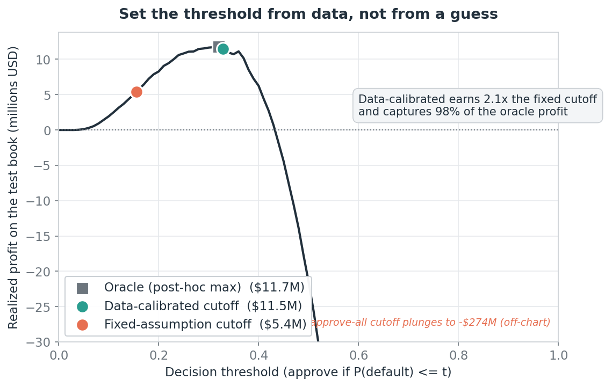
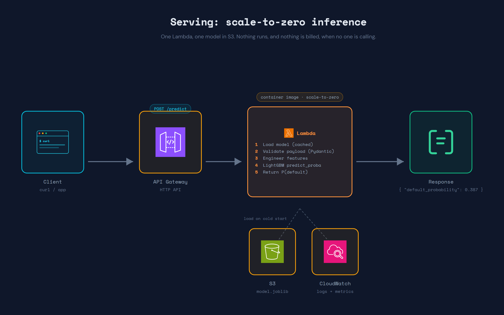
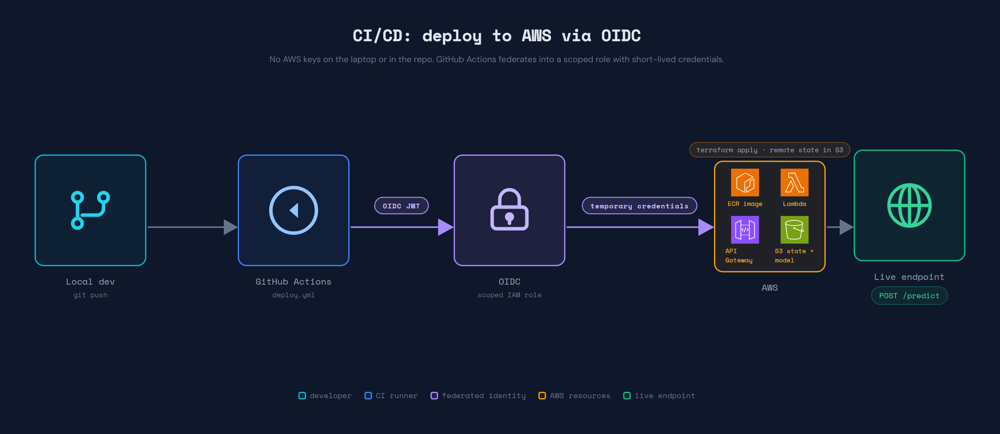
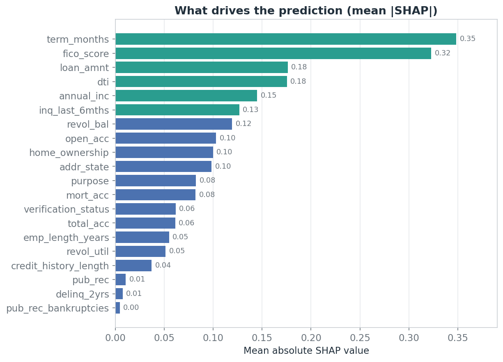
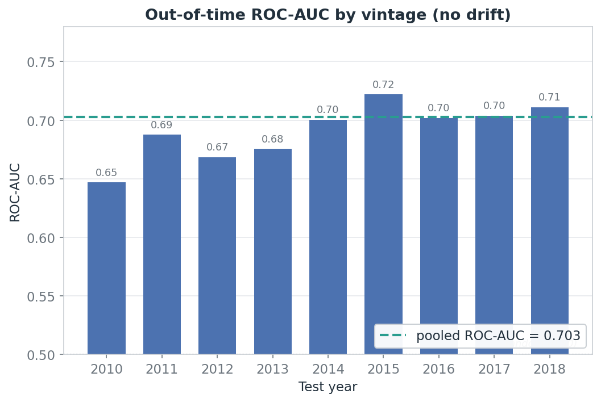
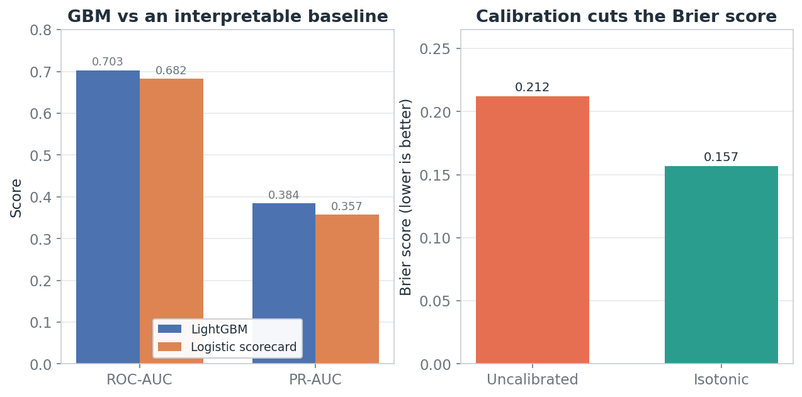
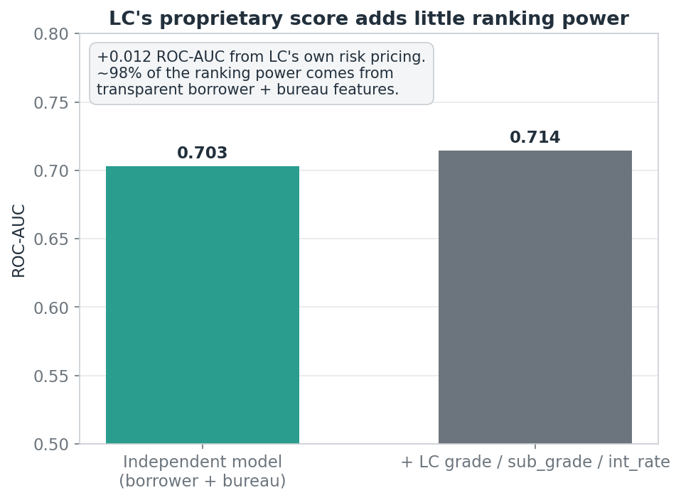

# Credit Risk ML Pipeline

A scale-to-zero pipeline that predicts consumer loan default and turns the
prediction into a lending decision. It starts from a business problem and its
asymmetric costs, not from a leaderboard metric, and it spans the full lifecycle
an ML engineer owns: data, features, honest validation, a tested Python package,
a serverless serving layer, and a CI/CD path that deploys it to AWS.

> **Status:** built end to end. The serving stack was deployed on AWS via
> GitHub Actions and verified live (the `/predict` endpoint returned the same
> score as the local smoke test, `0.387`), then torn down with `terraform
> destroy` to return to $0. It redeploys from a single `workflow_dispatch`.

The headline is engineering quality. The modeling is deliberately transparent
and honest rather than tuned for a vanity number, because in credit the decision
and its cost matter more than the third decimal of AUC.

## The business problem

A lender approving a loan faces an asymmetric bet. Approving a borrower who
defaults loses most of the principal. Declining a borrower who would have repaid
loses only the interest margin. A model that optimizes raw accuracy ignores this
asymmetry and ships the wrong decision threshold.

This project treats the problem the way a lender does:

- Predict the probability that a loan defaults.
- Choose the decision threshold from an expected-profit curve, not from 0.5.
- Keep the model honest about what it knew at application time (no leakage).
- Explain individual decisions, because credit decisions must be justifiable.

## Results at a glance

Trained on 2.2M real Lending Club loans, tested out-of-time on the most recent
283k (base default rate 21.8%), using only features known at application time.

| Metric | Value | Note |
|---|---|---|
| ROC-AUC (test) | **0.703** | Honest: LightGBM never sees Lending Club's own grade or rate |
| PR-AUC (test) | 0.384 | Base rate 21.8% |
| Profit vs a fixed-assumption cutoff | **2.1x** | Data-calibrated threshold, on realized cashflows |
| Share of the oracle profit captured | **98%** | vs 46% for the fixed-assumption cutoff |
| Uplift from adding LC's proprietary score | **+0.012** | The independent model already captures ~98% of its ranking power |

The strongest result is not the AUC. It is the decision: **setting the
approve/decline threshold from the data's own realized cashflows earns 2.1x the
profit of a plausible fixed-assumption threshold, and lands within 2% of the
post-hoc optimum.**



## Serving architecture



A request hits an HTTP API Gateway, which invokes a container-image Lambda. The
Lambda loads the LightGBM model from S3 once per cold start (then reuses it),
validates the payload with Pydantic, engineers the same features the training
code uses, and returns a calibrated default probability. Nothing runs, and
nothing is billed, when no one is calling.

The serving code and the training code share one source of truth: the feature
engineering and the model contract live in the `credit_risk` package and are
imported by both. That is why the deployed endpoint returned exactly the local
smoke-test score.

## CI/CD



There are no AWS keys on the laptop or in the repository, by design. GitHub
Actions federates into a scoped IAM role through OIDC and receives short-lived
credentials. The deploy workflow builds the container image, pushes it to ECR
tagged with the commit SHA, and runs `terraform apply` against remote state in
S3, which provisions the Lambda, the API Gateway, and a budget alarm. A
companion destroy workflow tears the whole stack back down to $0.

## Key technical decisions

**Independent risk model (exclude Lending Club's own pricing).** `grade`,
`sub_grade`, `int_rate`, and `installment` are Lending Club's internal risk
outputs. Feeding them back in would be scoring a scorecard. They are excluded
from the primary model so it learns an independent risk view from raw borrower
and bureau features. An ablation puts them back: they add only **+0.012**
ROC-AUC, so the transparent model already captures ~98% of the proprietary
score's ranking power. That is a strong, defensible result for a lender that
wants to own its risk view.

**Leakage as an allowlist, not a blocklist.** Only the ~20 columns known at
application time are eligible as features. A post-origination field (payments,
recoveries, hardship flags) can never slip in, because the default is to exclude.
A unit test asserts no leakage or pricing column reaches the model.

**Time-based split, not random.** Train on older vintages, test on the most
recent 20% by issue date. A random split would leak future macro conditions into
the test set and flatter the model. The temporal split is what a lender actually
faces: score next quarter's applicants with a model fit on the past.

**Cost calibrated from data, not assumed.** Loss-given-default (0.35) and margin
(0.17) are estimated from the training vintages' realized cashflows, then used to
derive the profit-maximizing threshold. Compared against a plausible fixed
assumption (LGD 0.65, margin 0.12), the calibrated cutoff earns 2.1x the profit
on the test book. The framing follows how IRB / IFRS 9 practitioners think about
expected loss.

**Calibrated probabilities.** `scale_pos_weight` fixes the class imbalance for
ranking but distorts the probabilities. Isotonic calibration cuts the test Brier
score from 0.212 to 0.157, which matters because the threshold is chosen on
probabilities, not just ranks.

**A GBM justified against a baseline.** LightGBM is not assumed; it is compared
to a logistic scorecard (the interpretable industry default). It wins by +0.020
ROC-AUC, enough to justify the gradient-boosted model while keeping the scorecard
as a credible fallback.

**Proportional tooling, on purpose.** Optuna hyperparameter search moved the test
ROC-AUC by +0.0009, so the hand-picked defaults were kept and the tuned params
were not adopted: the honest read is that hyperparameters are not the bottleneck,
features and the problem framing are. MLflow was deliberately not added; on a
~20-run project it would be tool-theater. Naming what to leave out is part of the
engineering.

## The analysis in figures

Every figure regenerates from the tracked metrics in `experiments/` with
`python -m credit_risk.plots`. No dataset, no model, and no training are required
to rebuild them.

**Global drivers (mean absolute SHAP).** Loan term, FICO, amount, DTI, and income
lead. The ranking is legible, which is a regulatory requirement in credit, not a
nice-to-have.



**Out-of-time stability.** ROC-AUC holds between 0.65 and 0.72 across vintages
from 2010 to 2018, with no visible drift. The model is evaluated the way it would
be used, quarter after quarter.



**Model choice and calibration.** LightGBM over a logistic scorecard, and the
effect of isotonic calibration on the Brier score.



**Ablation.** How little Lending Club's own risk pricing adds on top of the
transparent model.



## Dataset

**Lending Club** (2007 to 2018 Q4): real peer-to-peer consumer loans with
borrower, loan, and credit-bureau attributes and the final loan status. The label
(`default`) is defined from `loan_status`; loans still in progress are excluded
because their outcome is unknown. See [`data/README.md`](data/README.md) for
download instructions (the data is not committed).

## Repository structure

```
src/credit_risk/    Python package: config, data, features, split, train,
                    evaluate, calibrate, interpret, ablation, threshold_study,
                    baseline, validate, tune, inference, plots
notebooks/          EDA and modeling narrative
tests/              pytest suite (leakage guard, features, inference invariants)
serving/            FastAPI app + Pydantic schema + Mangum handler + Dockerfile
infra/              Terraform for the serverless stack (+ bootstrap for OIDC/state)
experiments/        metrics logged per run (JSON/CSV, tracked)
docs/               model card, architecture diagrams, generated figures
data/               download instructions (data is gitignored)
models/             model artifacts (gitignored)
```

## Quickstart

```bash
python -m venv .venv && source .venv/Scripts/activate   # Windows Git Bash
pip install -e ".[dev,serving]"
pytest -q                        # 32 tests: leakage guard, features, inference
python -m credit_risk.plots      # regenerate every figure from experiments/
```

Reproducing the analysis (needs the dataset downloaded, see `data/README.md`):

```bash
python -m credit_risk.train             # train + evaluate, log metrics
python -m credit_risk.threshold_study   # the profit curve and cutoffs
python -m credit_risk.validate          # baseline, calibration, temporal CV
python -m credit_risk.ablation          # the LC-score ablation
```

## Cost

Designed to stay at $0 at rest and single-digit dollars under a demo:

- Serverless inference (Lambda + API Gateway), scale-to-zero.
- Ephemeral: deploy for a demo, `terraform destroy` back to $0.
- The only standing cost is pennies of S3 and the ECR image (~$0.10/month).
- A budget alarm caps the worst case.

## Honest limitations

- **Dollar magnitudes are illustrative, the comparison is robust.** The recent
  test vintages are right-censored: good long-term loans that are still `Current`
  are dropped because their outcome is unknown, which biases the absolute profit
  figures. The relative comparison between thresholds (2.1x, 98% of oracle) is
  stable; the absolute dollars are directional, and the model card says so.
- **AUC around 0.70 is modest by design.** Removing Lending Club's own score is
  what makes the model honest and independent, and it costs ranking power. The
  ablation quantifies exactly how much.
- **One dataset, one lender.** The pipeline generalizes; the coefficients do not.

## Project phases

- **Phase 0:** scaffolding.
- **Phase 1:** EDA, feature engineering, leakage guard, cost calibration,
  threshold study, baseline / calibration / temporal validation, model card.
- **Phase 2:** refactor to a tested `src/` package, CI (ruff + pytest).
- **Phase 2.5:** Optuna tuning (confirmed the defaults were near-optimal).
- **Phase 3:** serverless serving (FastAPI + Mangum + Lambda + API Gateway),
  Terraform IaC, full CI/CD deploy via OIDC. Deployed, verified live, torn down.
- **Phase 4:** results, figures, architecture diagrams, this write-up.

## Author

Kevin Delgado. Former AI/Data roles at AWS and Deloitte.
More work at [kevdelgado.com](https://kevdelgado.com).
